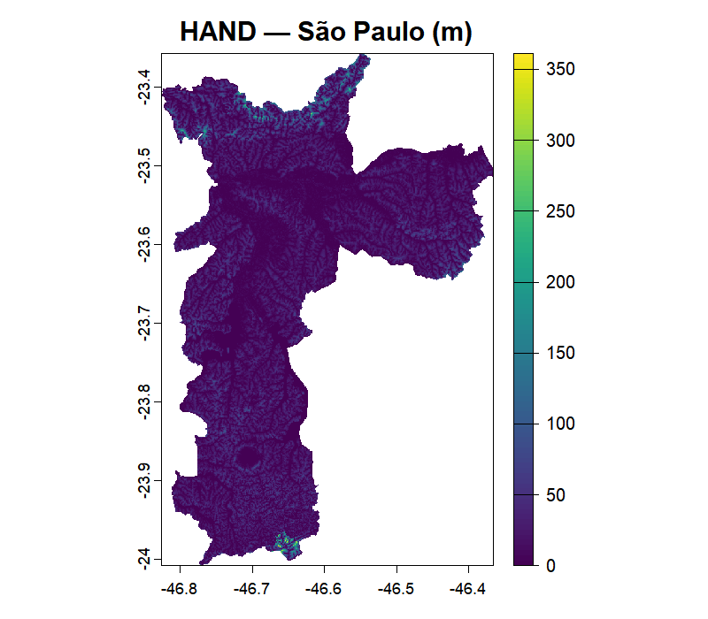

<!-- README.md is generated from README.Rmd. Please edit that file -->

```{r, include = FALSE}
knitr::opts_chunk$set(
  collapse = TRUE,
  comment = "#>",
  fig.path = "man/figures/README-",
  out.width = "100%"
)
```

# geohazards

<!-- badges: start -->

[](https://github.com/pedreirajr/geohazards/actions/workflows/R-CMD-check.yaml)
[](https://opensource.org/licenses/MIT)
[](https://lifecycle.r-lib.org/articles/stages.html#experimental)

<!-- badges: end -->

**geohazards** is an R package for extracting global data related to
climate risk, susceptibility, and vulnerability. It provides a simple
interface for accessing remote geospatial datasets (such as flood
susceptibility indices, landslide risk maps, and geological hazard
layers) directly from R, without manual downloading.

The package currently provides `get_hand()`, which retrieves the [GLO-30
HAND](https://registry.opendata.aws/glo-30-hand/) ([Height Above the
Nearest
Drainage](https://www.sciencedirect.com/science/article/abs/pii/S0022169411002599))
raster at 30 m resolution for any polygon supplied by the user. It is
actively being expanded with new data sources and functions, and is
planned for submission to CRAN.

## Installation

You can install the development version of geohazards from
[GitHub](https://github.com/pedreirajr/geohazards) with:

``` r
# install.packages("pak")
pak::pak("pedreirajr/geohazards")
```

## Example

The example below retrieves the HAND raster for the municipality of São
Paulo, Brazil. HAND measures, in metres, how high each point of the
terrain is above the nearest drainage channel, with lower values
indicate greater flood susceptibility.

```{r example, eval = FALSE}
library(geohazards)
library(geobr)

# Look up the IBGE code for São Paulo and download its boundary as an sf object
spo_ibge <- lookup_muni("São Paulo")$code_muni
spo_geo  <- read_municipality(code_muni = spo_ibge, year = 2022)

# Fetch the HAND raster clipped to the municipality boundary.
# Data is read remotely via Cloud Optimized GeoTIFF (no full tile downloads).
spo_hand <- get_hand(place = spo_geo)

# Visualise the result
terra::plot(spo_hand)
```


