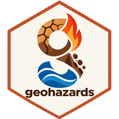
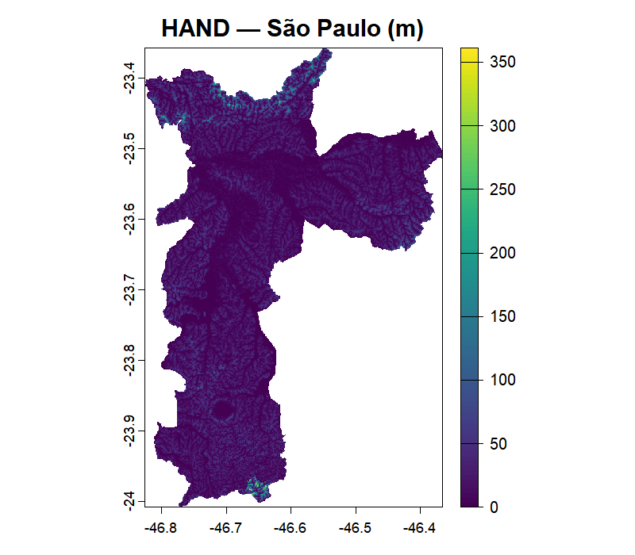
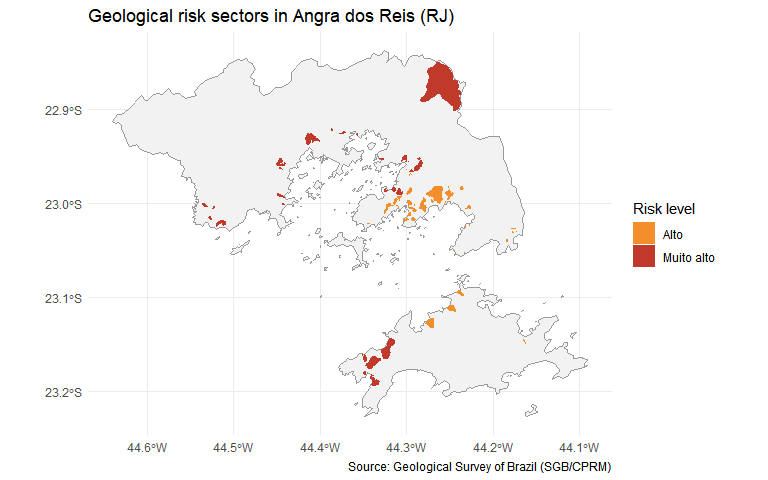

<!-- README.md is generated from README.Rmd. Please edit that file -->

# geohazards 

<!-- badges: start -->

[](https://github.com/pedreirajr/geohazards/actions/workflows/R-CMD-check.yaml)
[](https://opensource.org/licenses/MIT)
[](https://lifecycle.r-lib.org/articles/stages.html#experimental)

<!-- badges: end -->

**geohazards** is an R package for extracting global data related to
climate risk, susceptibility, and vulnerability. It provides a simple
interface for accessing remote geospatial datasets (such as flood
susceptibility indices, landslide risk maps, and geological hazard
layers) directly from R, without manual downloading.

The package currently covers two data sources:

- **GLO-30 HAND**, through `read_hand()`, which retrieves the [GLO-30
  HAND](https://registry.opendata.aws/glo-30-hand/) ([Height Above the
  Nearest
  Drainage](https://www.sciencedirect.com/science/article/abs/pii/S0022169411002599))
  raster at 30 m resolution for any polygon supplied by the user.
- **SGB/CPRM**, through `read_sgb()` and friends, which retrieve the
  geological risk cartography published by the [Geological Survey of
  Brazil](https://geoportal.sgb.gov.br/) — risk sectorisation, flood
  mapping and disaster occurrences — plus the technical reports
  deposited in its repository (RIGeo).

It is actively being expanded with new data sources and functions, and
is planned for submission to CRAN.

## Installation

You can install the development version of geohazards from GitHub with:

``` r
# install.packages("pak")
pak::pak("pedreirajr/geohazards")
```

## Example

The example below retrieves the HAND raster for the municipality of São
Paulo, Brazil. HAND measures, in metres, how high each point of the
terrain is above the nearest drainage channel, with lower values
indicate greater flood susceptibility.

``` r
library(geohazards)
library(geobr)

# Look up the IBGE code for São Paulo and download its boundary as an sf object
spo_ibge <- lookup_muni("São Paulo")$code_muni
spo_geo  <- read_municipality(code_muni = spo_ibge, year = 2022)

# Fetch the HAND raster clipped to the municipality boundary.
# Data is read remotely via Cloud Optimized GeoTIFF (no full tile downloads).
spo_hand <- read_hand(place = spo_geo)

# Visualise the result
terra::plot(spo_hand)
```



### Geological risk cartography (SGB/CPRM)

The example below inspects what the Geological Survey of Brazil has
mapped for a municipality and then downloads its risk sectorisation.
Before downloading anything, `sgb_inventory()` reports which products
exist and how many features each one has.

``` r
library(geohazards)

# The catalogue of products
knitr::kable(sgb_products())
```

| product | service | theme | type | key | scope | queryable |
|:---|:---|:---|:---|:---|:---|:---|
| risk | risco | risk | cartography | cd_geocmu | municipality | TRUE |
| risk_amazonas | risco_am | risk | cartography | cd_geocmu | municipality | TRUE |
| flood | inundacao | flood | cartography | municipio | municipality | TRUE |
| occurrence_pending | not_homolog_desastre_google | occurrence | occurrence | municipio | national | TRUE |
| occurrence_mobile | risco_mobile_google | occurrence | occurrence | municipio | national | TRUE |
| hazard | perigo | susceptibility | cartography | cd_geocmu | municipality | FALSE |
| debris_flow | corrida_de_massa | debris flow | cartography | municipio | municipality | FALSE |
| relief_pattern | padrao_relevo | relief pattern | cartography | municipio | municipality | FALSE |
| occurrence_approved | homolog_desastre_google | occurrence | occurrence | municipio | national | FALSE |

``` r

# What exists for a specific municipality
knitr::kable(sgb_inventory("Angra dos Reis", state = "RJ"))
```

| name_muni      | abbrev_state | theme | product | type        | n_features |
|:---------------|:-------------|:------|:--------|:------------|-----------:|
| Angra dos Reis | RJ           | risk  | risk    | cartography |         75 |
| Angra dos Reis | RJ           | flood | flood   | cartography |        198 |

`read_sgb_risk()` returns the risk sectorisation as an `sf` object in
SIRGAS 2000 (EPSG:4674), with every risk level mapped by the SGB.

``` r
angra <- read_sgb_risk("Angra dos Reis", state = "RJ")

# Sectors and people at risk by risk level
table(angra$risk_level)
#> 
#>       Alto Muito alto 
#>         44         31
tapply(angra$n_people, angra$risk_level, sum, na.rm = TRUE)
#>       Alto Muito alto 
#>      31944      12904
```

``` r
library(ggplot2)

# Municipality boundary for context
angra_muni <- geobr::read_municipality(code_muni = angra$code_muni[1],
                                       year = 2022, showProgress = FALSE)
#> ℹ Using year/date 2022

ggplot() +
  geom_sf(data = angra_muni, fill = "grey95", colour = "grey60") +
  geom_sf(data = angra, aes(fill = risk_level), colour = NA) +
  scale_fill_manual(values = c("Alto" = "#f28e2b", "Muito alto" = "#c0392b"),
                    name = "Risk level") +
  labs(title = "Geological risk sectors in Angra dos Reis (RJ)",
       caption = "Source: Geological Survey of Brazil (SGB/CPRM)") +
  theme_minimal()
```



Important: the SGB mapping is not universal. A municipality with no
features comes back as an empty `sf` object with a warning. Absence of
mapping is not absence of risk.

If you use {geohazards} in your work, please cite it as:

> Pedreira Junior, J.U. & Pedrassoli, J. (2026). geohazards: an R
> package for extracting global data related to climate risk,
> susceptibility, and vulnerability. GitHub repository:
> <https://github.com/pedreirajr/geohazards>
