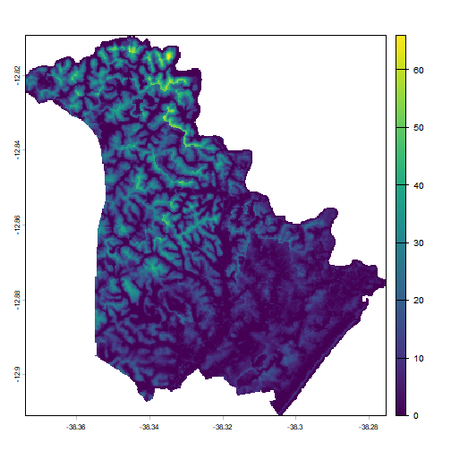
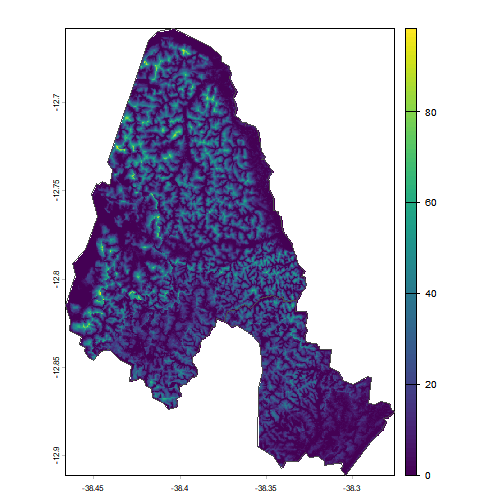
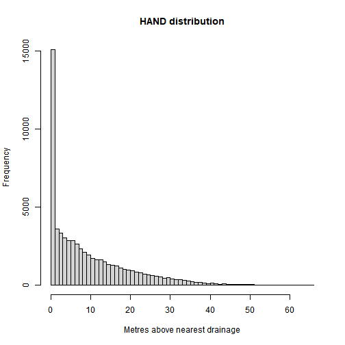
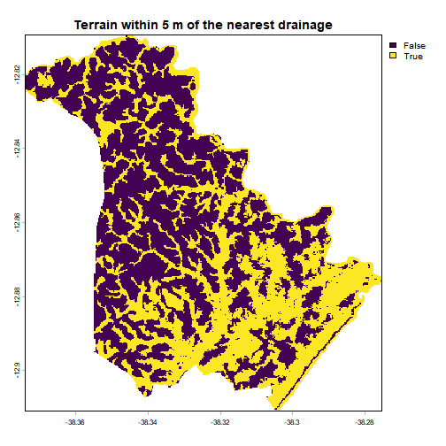
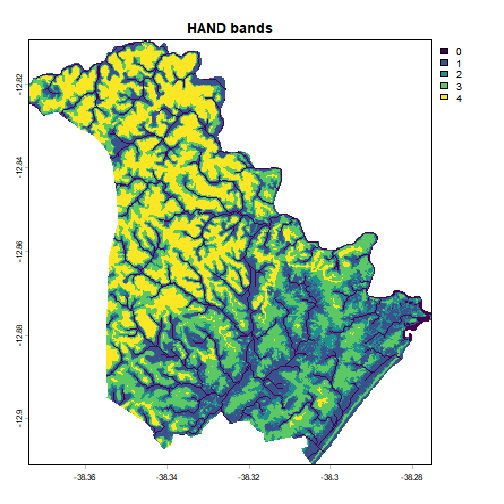
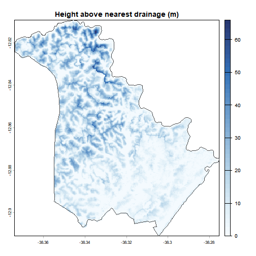
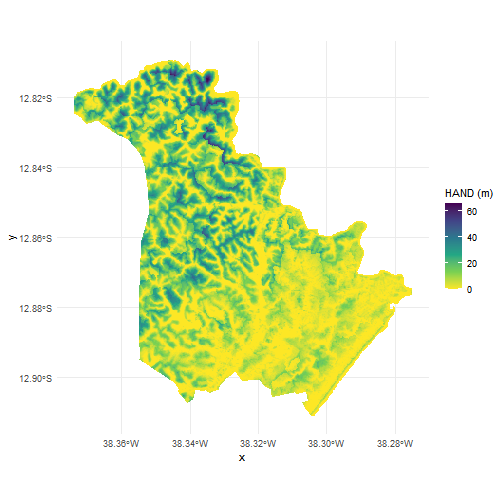

# Flood susceptibility with GLO-30 HAND

HAND (Height Above the Nearest Drainage), introduced by Nobre et
al. (2011), measures, for every cell of a terrain model, how high that
cell sits above the drainage channel it flows into. It is a relative
elevation, not an absolute one: a cell 2 m above its channel is close to
the water level whether it stands at 10 m or at 1000 m of altitude. That
makes it one of the cheapest proxies for flood susceptibility available
globally, as low HAND means the terrain is near the level the water
reaches.

> Nobre, A. D., Cuartas, L. A., Hodnett, M., Rennó, C. D., Rodrigues,
> G., Silveira, A., Waterloo, M., & Saleska, S. (2011). Height Above the
> Nearest Drainage – a hydrologically relevant new terrain model.
> *Journal of Hydrology*, 404(1–2), 13–29.
> <https://doi.org/10.1016/j.jhydrol.2011.03.051>

[`read_hand()`](https://pedreirajr.github.io/geohazards/reference/read_hand.md)
returns the GLO-30 HAND raster, derived from the Copernicus 30 m DEM,
clipped to any polygon you give it.

``` r

library(geohazards)
library(terra)
library(sf)
library(dplyr)
```

## Reading a raster for an area

[`read_hand()`](https://pedreirajr.github.io/geohazards/reference/read_hand.md)
takes an `sf` object with POLYGON or MULTIPOLYGON geometry. Any polygon
works (a watershed, a neighbourhood, a study area drawn by hand), but
municipal boundaries are the most common case. In the Brazilian case,
**geobr** provides the official IBGE ones:

``` r

# Lauro de Freitas (BA): small, coastal, and covered by a single tile
muni <- geobr::read_municipality(code_muni = 2919207, year = 2022,
                                 simplified = FALSE, showProgress = FALSE)

hand <- read_hand(muni)

hand
#> class       : SpatRaster
#> size        : 366, 356, 1  (nrow, ncol, nlyr)
#> resolution  : 0.0002777778, 0.0002777778  (x, y)
#> extent      : -38.37403, -38.27514, -12.91097, -12.80931  (xmin, xmax, ymin, ymax)
#> coord. ref. : lon/lat WGS 84 (EPSG:4326)
#> source(s)   : memory
#> varname     : hand
#> name        :      hand
#> min value   :         0
#> max value   : 65.981606
plot(hand)
```



Nothing is downloaded in full. The GLO-30 HAND tiles are Cloud Optimized
GeoTIFFs, so only the blocks that intersect the polygon travel over the
network.
[`read_hand()`](https://pedreirajr.github.io/geohazards/reference/read_hand.md)
reports how many 1×1 degree tiles the area spans, which is a good sanity
check, given that a request covering many tiles is a large request, even
with COG.

Values are in **metres above the nearest drainage**, and the raster is
masked to the boundary, so cells outside the polygon are `NA`.

### Coordinate systems

The dataset is published in WGS84 (EPSG:4326), and that is what comes
back by default, whatever the CRS of `place`. The polygon is reprojected
internally for tile discovery, never the other way round.

If you wish a projected CRS to get a raster in metres, use the
`crs_output` argument:

``` r

# UTM zone 24S, metric units
hand_utm <- read_hand(muni, crs_output = 31984)

res(hand_utm)  # cell size in metres
#> [1] 30.44014 30.44014
```

Reprojection uses bilinear resampling, which is the right choice for a
continuous surface. With `crs_output` you can do it once, at reading
time, rather than reprojecting derived products later.

### Several polygons at once

When `place` has more than one feature, the features are unioned and the
raster is masked to the combined boundary:

``` r

# Lauro de Freitas and its neighbour Simoes Filho
neighbours <- geobr::read_municipality(code_muni = c(2919207, 2930709),
                                       year = 2022, showProgress = FALSE)
hand_pair <- read_hand(neighbours)

plot(hand_pair)
plot(st_geometry(neighbours), add = TRUE, border = "grey30")
```



## Reading the values

There is no universal cut-off that turns HAND into a flood map, and the
sensible threshold depends on the basin, the channel network used to
derive the product and the return period you have in mind. Values in the
single digits of metres are the usual starting point, and the result
should be treated as a screening layer.

To explore the values with **dplyr**, take them out of the raster as a
data frame, one row per cell in a column named `hand` (`na.rm = TRUE`
drops the cells outside the boundary):

``` r

hand_values <- as.data.frame(hand, na.rm = TRUE)

hand_values |>
  summarise(
    cells = n(),
    mean = mean(hand),
    p05 = quantile(hand, 0.05),
    median = median(hand),
    p95 = quantile(hand, 0.95)
  )
#>   cells     mean p05   median      p95
#> 1 63390 9.654945   0 6.339997 30.78297
```

``` r

hist(hand_values$hand, breaks = 50,
     main = "HAND distribution", xlab = "Metres above nearest drainage")
```



A screening mask is a single comparison:

``` r

lowland <- hand < 5
plot(lowland, main = "Terrain within 5 m of the nearest drainage")
```



``` r


# Share of the municipality below the threshold
hand_values |>
  summarise(share_below_5m = mean(hand < 5))
#>   share_below_5m
#> 1      0.4398959
```

Classifying into bands is often more honest than a binary mask, because
it keeps the gradient visible:

``` r

bands <- matrix(c(
   0,  2, 1,   # very low terrain, closest to the channel
   2,  5, 2,
   5, 15, 3,
  15, Inf, 4   # well above the drainage
), ncol = 3, byrow = TRUE)

hand_class <- classify(hand, bands)
plot(hand_class, main = "HAND bands")
```



The same bands, counted on the data frame, give the share of the area in
each:

``` r

hand_values |>
  mutate(band = cut(hand, breaks = c(0, 2, 5, 15, Inf),
                    labels = c("0-2 m", "2-5 m", "5-15 m", "> 15 m"),
                    include.lowest = TRUE)) |>
  count(band) |>
  mutate(share = n / sum(n))
#>     band     n     share
#> 1  0-2 m 18659 0.2943524
#> 2  2-5 m  9226 0.1455435
#> 3 5-15 m 19747 0.3115160
#> 4 > 15 m 15758 0.2485881
```

## Mapping

The raster is a plain `SpatRaster`, so every terra and ggplot2 workflow
applies. A palette that goes from wet to dry reads better than the
default:

``` r

plot(hand, col = hcl.colors(50, "Blues", rev = TRUE),
     main = "Height above nearest drainage (m)")
plot(st_geometry(muni), add = TRUE, border = "grey30")
```



With **ggplot2**, convert to a data frame with the cell coordinates
first:

``` r

library(ggplot2)

hand_df <- as.data.frame(hand, xy = TRUE)

ggplot(hand_df, aes(x, y, fill = hand)) +
  geom_raster() +
  scale_fill_viridis_c(name = "HAND (m)", direction = -1) +
  coord_sf(crs = 4326) +
  theme_minimal()
```



## Exporting

``` r

writeRaster(hand, "hand.tif", overwrite = TRUE)

# Smaller file, same values, for sharing
writeRaster(hand, "hand_compressed.tif", overwrite = TRUE,
            gdal = c("COMPRESS=DEFLATE", "PREDICTOR=3"))
```

## Caveats

- **HAND is not a flood map.** It knows nothing about rainfall, river
  discharge, drainage infrastructure, tides or dams, and a cell can be
  low above its channel and still rarely flood.
- **The drainage network is modelled**, derived from the DEM, so HAND
  inherits every error of the underlying elevation model. Dense urban
  areas and flat floodplains are where it struggles most.
- **30 m cells** do not resolve individual buildings or street-level
  drainage.
- **Coastal flooding** driven by the sea, rather than by a channel, is
  outside what HAND represents.

## Source

GLO-30 HAND, published on the [AWS Open Data
registry](https://registry.opendata.aws/glo-30-hand/) and derived from
the Copernicus GLO-30 DEM. The HAND terrain descriptor itself is due to
Nobre et al. (2011), cited at the top of this article. Municipality
boundaries come from the IBGE mesh, through **geobr**.
